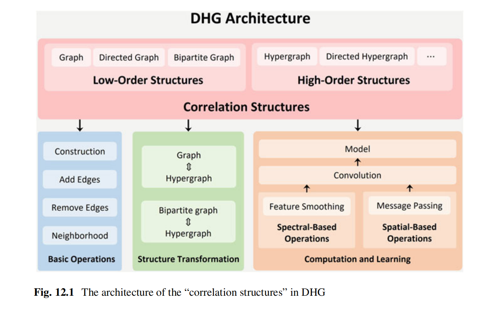
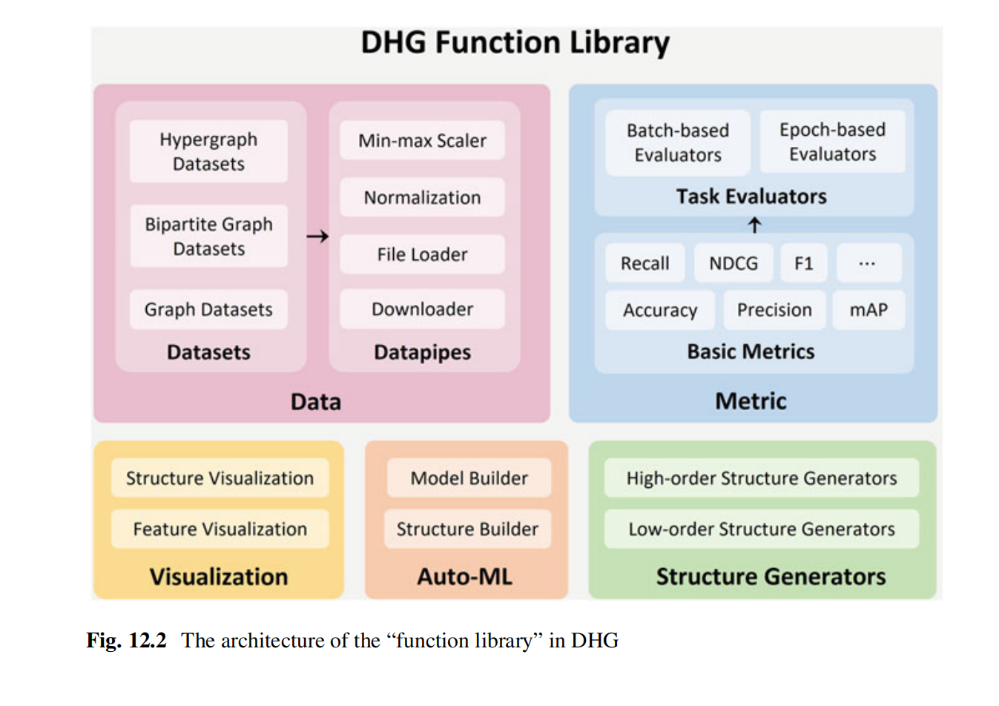
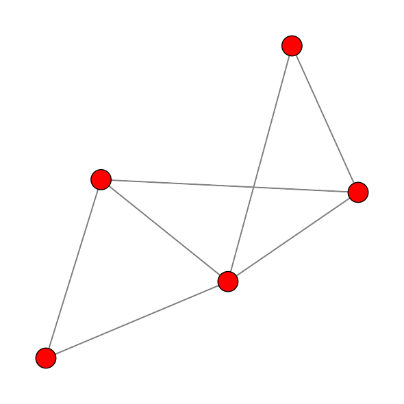
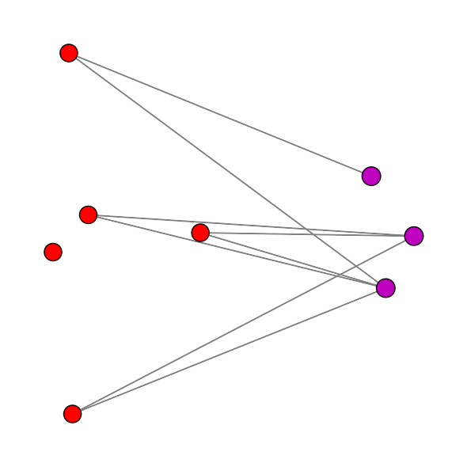
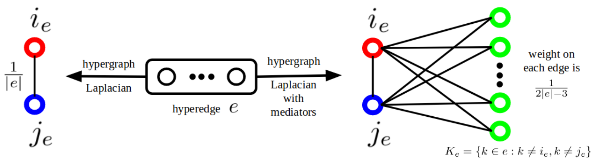
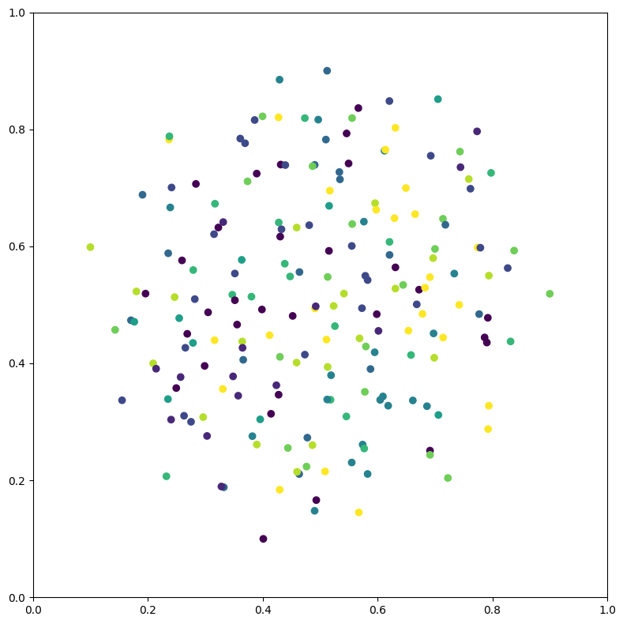
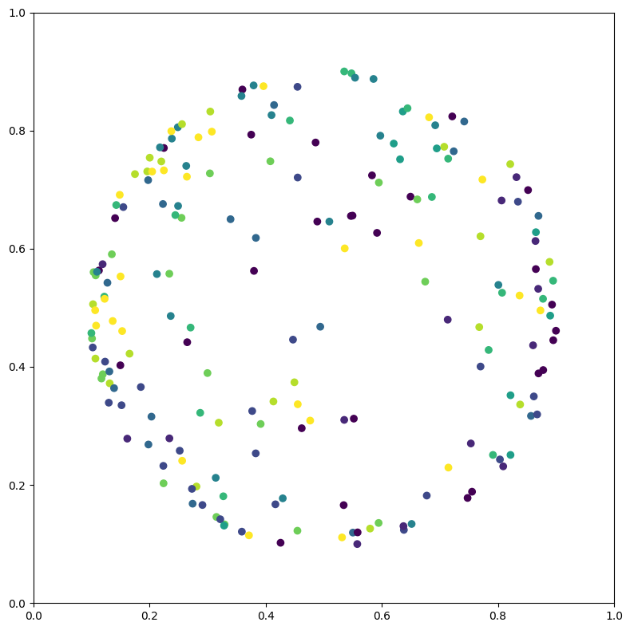

<!--  -->
<!--  -->

[DHG](https://deephypergraph.readthedocs.io/en/latest/index.html)（DeepHypergraph）是一个基于PyTorch的深度学习库，用于图神经网络和超图神经网络的学习。
[GitHub](https://github.com/iMoonLab/DeepHypergraph/tree/main)

目前库版本的情况如下

python>=3.8

torch==1.13.1

numpy==1.24.1

安装cpu版pytorch的话，代码为
`conda install pytorch==1.13.1 cpuonly -c pytorch`

之后再安装dhg就可以了
`pip install dhg`





## 图上数据的信息聚合
首先我们构建一个图：


```python
# %load ./test_graph.py
import torch
import dhg
import matplotlib.pyplot as plt
# 构建图
g = dhg.Graph(5, [(0, 1), (0, 2), (1, 3), (3, 4), (0, 4), (2, 4), (1, 4)], merge_op="mean")
print(g.v)
print(g.e)
print(g.A.to_dense())

# 也可以从邻接表构建图
# g = dhg.Graph.from_adj_list(5, [[0, 1, 2], [1, 3], [4, 3, 0, 2, 1]])
# 也可以用随机方法构建图
# g = dhg.random.graph_Gnm(5, 8)
# 随机初始化一个特征矩阵
# # Generate a vertex feature matrix with size 5x2
X = torch.rand(5, 2)

# 图的可视化
g.draw()
plt.show()

```

    [0, 1, 2, 3, 4]
    ([(0, 1), (0, 2), (1, 3), (3, 4), (0, 4), (2, 4), (1, 4)], [1.0, 1.0, 1.0, 1.0, 1.0, 1.0, 1.0])
    tensor([[0., 1., 1., 0., 1.],
            [1., 0., 0., 1., 1.],
            [1., 0., 0., 0., 1.],
            [0., 1., 0., 0., 1.],
            [1., 1., 1., 1., 0.]])





接下来对特征进行谱方法的信息聚合
$D_v^{-1/2}\hat{A} D_v^{-1/2}X$  ，其中$\hat{A} = A+I$


（GCN流程为$X' = \sigma\left(D_v^{-1/2}\hat{A} D_v^{-1/2}X\Theta\right)$，相当于对信息聚合之后进行了线性与非线性变换）


```python
X_ = g.smoothing_with_GCN(X)
print(X_)
# # Print the inside Laplacian Matrix by GCN on the graph structure
# g.L_GCN.to_dense()
# # tensor([[0.2000, 0.2582, 0.2236, 0.2000, 0.2236],
# #         [0.2582, 0.3333, 0.0000, 0.2582, 0.0000],
# #         [0.2236, 0.0000, 0.2500, 0.2236, 0.2500],
# #         [0.2000, 0.2582, 0.2236, 0.2000, 0.2236],
# #         [0.2236, 0.0000, 0.2500, 0.2236, 0.2500]])
# # Print the vertex features after GCN-based smoothing
# X_
# # tensor([[0.5434, 0.6609],
# #         [0.5600, 0.5668],
# #         [0.3885, 0.6289],
# #         [0.5434, 0.6609],
# #         [0.3885, 0.6289]])

```

    tensor([[0.6417, 0.6457],
            [0.5446, 0.6341],
            [0.4993, 0.7136],
            [0.4394, 0.5295],
            [0.6027, 0.8027]])


空域聚合，流程写作矩阵形式为$D_v^{-1} A X$

其中D_v：点度矩阵


```python
# graphsage 空域聚合

X = torch.rand(5, 2)
# D_v diagnal matrix of vertex degree 
# D_v^{-1}*A*X
X_ = g.v2v(X, aggr="mean")
print(X_)

```

    tensor([[0.2214, 0.5098],
            [0.5987, 0.4187],
            [0.6447, 0.3750],
            [0.3031, 0.5824],
            [0.3784, 0.5216]])


也可以将谱域与空域聚合的信息加和


```python
# 谱域与空域聚合的信息加和
X_ = (g.smoothing_with_GCN(X) + g.v2v(X, aggr="mean"))/2
print(X_)
```

    tensor([[0.2906, 0.4986],
            [0.5440, 0.4734],
            [0.5109, 0.3512],
            [0.3163, 0.5384],
            [0.4156, 0.5441]])


有向图的信息传递，目前模块只提供了空域上的信息聚合，比如source to target上的信息聚合为$D_v^{-1}A^{\top}X$


```python
g = dhg.DiGraph(5, [(0, 3), (2, 4), (4, 2), (3, 1)])
X = torch.rand(5, 2)
X_src2dst = g.v2v(X, aggr="mean", direction="src2dst")
print(X_src2dst)
```

    tensor([[0.0000, 0.0000],
            [0.7418, 0.1746],
            [0.4465, 0.7063],
            [0.8576, 0.3098],
            [0.8349, 0.0401]])


二分图（bigraph）的信息聚合


```python
#随机初始化一个二部图，分两部U,V，节点数分别为3，5，随机生成8条边
g = dhg.random.bigraph_Gnm(3, 5, 8)


# B(3,5),B^T,稀疏U,V关联矩阵
print(g.B.to_dense())
# Generate feature matrix for vertices in set U and set V, respectively.
X_u, X_v = torch.rand(3, 2), torch.rand(5, 2)


g.draw()
plt.show()

```

    tensor([[1., 1., 1., 0., 0.],
            [1., 1., 1., 1., 0.],
            [0., 0., 0., 1., 0.]])





B为U,V的bipartite adjacency matrix(3×5)，相当于超图的关联矩阵

特征聚合方式为$X_u = D_u^{-1} B X_v$，$X_v =  D_v^{-1} {B}^{\top} X_u$


```python
# Propagate messages from vertices in set V to vertices in set U with mean aggregation
X_u_ = g.v2u(X_v, aggr="mean")
# Propagate messages from vertices in set U to vertices in set V with mean aggregation
# D_v^{-1} B^T X_u
X_v_ = g.u2v(X_u, aggr="mean")
```

## 超图的信息聚合


```python
import torch
import dhg

hg = dhg.Hypergraph(5, [(0, 1, 2), (1, 3, 2), (1, 2), (0, 3, 4)])
print(hg.e)
print(hg.H.to_dense())

# 也可以构建随机超图，初始设定5点4边
# hg = dhg.random.hypergraph_Gnm(5, 4)
# print(hg.e)
# 随机初始化每个节点的两维特征
X = torch.rand(5, 2)

```

    ([(0, 1, 2), (1, 2, 3), (1, 2), (0, 3, 4)], [1.0, 1.0, 1.0, 1.0])
    tensor([[1., 0., 0., 1.],
            [1., 1., 1., 0.],
            [1., 1., 1., 0.],
            [0., 1., 0., 1.],
            [0., 0., 0., 1.]])


特别地，此模块对于由超图构建普通图，除却star与clique的方法之外，还提供了一种由超图生成图的办法，来自 [HyperGCN](https://arxiv.org/pdf/1809.02589)

$(i_e,j_e) := \argmax_{i,j\in e}|S_i - S_j|$ 



```python
# 特别地，可以由hypergraph构建g
g = dhg.Graph.from_hypergraph_hypergcn(hg, X)
```

超图上的信息聚合也分两种，谱域上的与空域上的。
首先来看谱域上的超图图卷积流程：
$$\mathcal{L}_{HGNN} = \sigma\left(\mathbf{D}_v^{-\frac{1}{2}} \mathbf{H} \mathbf{W}_e \mathbf{D}_e^{-1} \mathbf{H}^\top \mathbf{D}_v^{-\frac{1}{2}}\mathbf{X}\Theta\right)$$

其中的信息聚合
$D_v^{-1/2} H W_e D_e^{-1}H^T D_v^{-1/2}X$


```python
# Message propagation from hyperedge to vertex
X_ = hg.smoothing_with_HGNN(X)
```

空域上的信息聚合,H: $n×m$

$X_e = D_e^{-1} H^T X_v$

$X_v = D_v^{-1} H X_e$

或者也可以在超边信息聚合到节点上时加上超边权重:
$X_v = D_v^{-1}  H W_e X_e$


```python

# X_e = D_e^{-1}H^T X_v
# 点到超边
Y_ = hg.v2e(X, aggr="mean")
# 超边到点
X_ = hg.e2v(Y_,aggr="mean")

# X_v = D_v^{-1}  H W_e X_e
# 或者也可以加上超边权重
e2v_weight = torch.rand(len(hg.e2v_weight))
X_ = hg.e2v(Y_,e2v_weight=e2v_weight,aggr="mean")
 
# Or, you can pass messages from vertex set to vertex set with mean aggregation by:
# 也可以直接将这个v2e,e2v两步走写成以下v2v形式
X_ = hg.v2v(X, aggr="mean")
```

## 图卷积与超图卷积实现

模块提供了基本图卷积层与超图卷积层的代码可供调用，具体实现就是采用模块中上述所提到的信息聚合函数，再依需要进行特征变换。

下面是一个简单的GCN卷积层的代码:


```python
import dhg
import torch
import torch.nn as nn

class GCNConv(nn.Module):
    def __init__(
        self,
        in_channels: int,
        out_channels: int,
        bias: bool = True,
        drop_rate: float = 0.5,
    ):
        super().__init__()
        self.act = nn.ReLU(inplace=True)
        self.drop = nn.Dropout(drop_rate)
        self.theta = nn.Linear(in_channels, out_channels, bias=bias)

    def forward(self, X: torch.Tensor, g: dhg.Graph) -> torch.Tensor:
        X = self.theta(X)
        X_ = g.smoothing_with_GCN(X)
        X_ = self.drop(self.act(X_))
        return X_
    
g = dhg.Graph(5, [(0, 1), (0, 2), (1, 3), (3, 4), (0, 4), (2, 4), (1, 4)])
X = torch.rand(5,2)
gcn = GCNConv(2,1)
X_ = gcn(X,g)
# print(X_)
```

下面是一个超图节点分类的示例代码，借助了模块自带的Cooking200数据集，模型为由两个超图卷积层HGNNConv封装好的节点分类模型HGNN，损失为交叉熵损失。
模型训练与评估大同小异，我们来看其中比较核心的几句代码：
```python
G = Hypergraph(data["num_vertices"], data["edge_list"])
net = HGNN(X.shape[1], 32, data["num_classes"], use_bn=True)
outs = net(X, G)
```
也就是说，我们需要输入的是超图G与初始特征矩阵X，
G的确定需要节点数与超边列表（形如[(0, 1, 2), (1, 2)]），模型初始化时需要输入层的特征维数、隐藏层维数、输出层（分类层）维数，调用时输入特征矩阵X和超图G。


```python
import time
from copy import deepcopy

import torch
import torch.optim as optim
import torch.nn.functional as F

from dhg import Hypergraph
from dhg.data import Cooking200
from dhg.models import HGNN
from dhg.random import set_seed
from dhg.metrics import HypergraphVertexClassificationEvaluator as Evaluator
def train(net, X, A, lbls, train_idx, optimizer, epoch):
    net.train()

    st = time.time()
    optimizer.zero_grad()
    outs = net(X, A)
    outs, lbls = outs[train_idx], lbls[train_idx]
    loss = F.cross_entropy(outs, lbls)
    loss.backward()
    optimizer.step()
    print(f"Epoch: {epoch}, Time: {time.time()-st:.5f}s, Loss: {loss.item():.5f}")
    return loss.item()


@torch.no_grad()
def infer(net, X, A, lbls, idx, test=False):
    net.eval()
    outs = net(X, A)
    outs, lbls = outs[idx], lbls[idx]
    if not test:
        res = evaluator.validate(lbls, outs)
    else:
        res = evaluator.test(lbls, outs)
    return res

if __name__ == "__main__":
    set_seed(2021)
    device = torch.device("cuda") if torch.cuda.is_available() else torch.device("cpu")
    evaluator = Evaluator(["accuracy", "f1_score", {"f1_score": {"average": "micro"}}])
    data = Cooking200()

    X, lbl = torch.eye(data["num_vertices"]), data["labels"]
    G = Hypergraph(data["num_vertices"], data["edge_list"])
    train_mask = data["train_mask"]
    val_mask = data["val_mask"]
    test_mask = data["test_mask"]

    net = HGNN(X.shape[1], 32, data["num_classes"], use_bn=True)
    optimizer = optim.Adam(net.parameters(), lr=0.01, weight_decay=5e-4)

    X, lbl = X.to(device), lbl.to(device)
    G = G.to(device)
    net = net.to(device)

    best_state = None
    best_epoch, best_val = 0, 0
    for epoch in range(200):
        # train
        train(net, X, G, lbl, train_mask, optimizer, epoch)
        # validation
        if epoch % 1 == 0:
            with torch.no_grad():
                val_res = infer(net, X, G, lbl, val_mask)
            if val_res > best_val:
                print(f"update best: {val_res:.5f}")
                best_epoch = epoch
                best_val = val_res
                best_state = deepcopy(net.state_dict())
    print("\ntrain finished!")
    print(f"best val: {best_val:.5f}")
    # test
    print("test...")
    net.load_state_dict(best_state)
    res = infer(net, X, G, lbl, test_mask, test=True)
    print(f"final result: epoch: {best_epoch}")
    print(res)
```

    Epoch: 0, Time: 0.57075s, Loss: 2.99680
    update best: 0.05000
    Epoch: 1, Time: 0.44458s, Loss: 2.71560
    Epoch: 2, Time: 0.34824s, Loss: 2.34183
    Epoch: 3, Time: 0.33715s, Loss: 2.17803
    Epoch: 4, Time: 0.35491s, Loss: 2.04616
    Epoch: 5, Time: 0.35887s, Loss: 1.90518
    Epoch: 6, Time: 0.32666s, Loss: 1.78512
    Epoch: 7, Time: 0.33858s, Loss: 1.66366
    Epoch: 8, Time: 0.31702s, Loss: 1.53951
    Epoch: 9, Time: 0.32943s, Loss: 1.43321
    Epoch: 10, Time: 0.33378s, Loss: 1.34211
    Epoch: 11, Time: 0.30918s, Loss: 1.22630
    Epoch: 12, Time: 0.30787s, Loss: 1.11867
    Epoch: 13, Time: 0.34970s, Loss: 1.01440
    Epoch: 14, Time: 0.33104s, Loss: 0.93420
    Epoch: 15, Time: 0.30302s, Loss: 0.83996
    Epoch: 16, Time: 0.30275s, Loss: 0.76163
    Epoch: 17, Time: 0.30708s, Loss: 0.68340
    update best: 0.05500
    Epoch: 18, Time: 0.33452s, Loss: 0.61747
    update best: 0.07000
    Epoch: 19, Time: 0.31939s, Loss: 0.56980
    update best: 0.08500
    Epoch: 20, Time: 0.30552s, Loss: 0.50861
    update best: 0.09500
    Epoch: 21, Time: 0.35976s, Loss: 0.44348
    update best: 0.11000
    Epoch: 22, Time: 0.30756s, Loss: 0.39887
    update best: 0.12000
    Epoch: 23, Time: 0.31043s, Loss: 0.35758
    update best: 0.13000
    Epoch: 24, Time: 0.31487s, Loss: 0.32404
    update best: 0.13500
    Epoch: 25, Time: 0.29691s, Loss: 0.29471
    Epoch: 26, Time: 0.29033s, Loss: 0.25857
    update best: 0.14000
    Epoch: 27, Time: 0.30515s, Loss: 0.23327
    Epoch: 28, Time: 0.29754s, Loss: 0.20164
    Epoch: 29, Time: 0.35460s, Loss: 0.18018
    Epoch: 30, Time: 0.30009s, Loss: 0.16439
    Epoch: 31, Time: 0.29091s, Loss: 0.14320
    Epoch: 32, Time: 0.32527s, Loss: 0.12419
    Epoch: 33, Time: 0.29964s, Loss: 0.11924
    Epoch: 34, Time: 0.30927s, Loss: 0.10919
    update best: 0.15000
    Epoch: 35, Time: 0.29960s, Loss: 0.09785
    update best: 0.15500
    Epoch: 36, Time: 0.30507s, Loss: 0.09012
    Epoch: 37, Time: 0.29983s, Loss: 0.08261
    Epoch: 38, Time: 0.27957s, Loss: 0.07587
    Epoch: 39, Time: 0.28515s, Loss: 0.07044
    Epoch: 40, Time: 0.28125s, Loss: 0.06598
    Epoch: 41, Time: 0.28380s, Loss: 0.06401
    Epoch: 42, Time: 0.30753s, Loss: 0.05707
    Epoch: 43, Time: 0.34185s, Loss: 0.05931
    update best: 0.16500
    Epoch: 44, Time: 0.30149s, Loss: 0.05196
    Epoch: 45, Time: 0.29131s, Loss: 0.05082
    Epoch: 46, Time: 0.28986s, Loss: 0.05012
    Epoch: 47, Time: 0.30059s, Loss: 0.04576
    Epoch: 48, Time: 0.29840s, Loss: 0.04435
    Epoch: 49, Time: 0.30359s, Loss: 0.04230
    Epoch: 50, Time: 0.29037s, Loss: 0.04270
    Epoch: 51, Time: 0.29047s, Loss: 0.04103
    Epoch: 52, Time: 0.28586s, Loss: 0.04028
    Epoch: 53, Time: 0.30024s, Loss: 0.04073
    Epoch: 54, Time: 0.30922s, Loss: 0.04037
    update best: 0.17500
    Epoch: 55, Time: 0.29788s, Loss: 0.03870
    update best: 0.18000
    Epoch: 56, Time: 0.30937s, Loss: 0.03931
    update best: 0.18500
    Epoch: 57, Time: 0.31250s, Loss: 0.03899
    update best: 0.20000
    Epoch: 58, Time: 0.29095s, Loss: 0.03811
    update best: 0.23000
    Epoch: 59, Time: 0.28320s, Loss: 0.03616
    update best: 0.24000
    Epoch: 60, Time: 0.34368s, Loss: 0.03745
    update best: 0.24500
    Epoch: 61, Time: 0.27734s, Loss: 0.03472
    Epoch: 62, Time: 0.30756s, Loss: 0.03635
    Epoch: 63, Time: 0.30114s, Loss: 0.03429
    Epoch: 64, Time: 0.29200s, Loss: 0.03394
    Epoch: 65, Time: 0.28902s, Loss: 0.03186
    Epoch: 66, Time: 0.28697s, Loss: 0.03094
    update best: 0.25000
    Epoch: 67, Time: 0.30515s, Loss: 0.03513
    update best: 0.27000
    Epoch: 68, Time: 0.29123s, Loss: 0.03170
    update best: 0.28000
    Epoch: 69, Time: 0.32443s, Loss: 0.03075
    update best: 0.29000
    Epoch: 70, Time: 0.31617s, Loss: 0.03026
    update best: 0.30500
    Epoch: 71, Time: 0.31604s, Loss: 0.02878
    update best: 0.32500
    Epoch: 72, Time: 0.32258s, Loss: 0.02952
    update best: 0.34000
    Epoch: 73, Time: 0.29982s, Loss: 0.02851
    update best: 0.35000
    Epoch: 74, Time: 0.31248s, Loss: 0.02806
    Epoch: 75, Time: 0.28563s, Loss: 0.02752
    update best: 0.35500
    Epoch: 76, Time: 0.28265s, Loss: 0.02637
    update best: 0.36500
    Epoch: 77, Time: 0.29957s, Loss: 0.02755
    update best: 0.37500
    Epoch: 78, Time: 0.29673s, Loss: 0.02571
    update best: 0.40000
    Epoch: 79, Time: 0.30071s, Loss: 0.02681
    update best: 0.41000
    Epoch: 80, Time: 0.30660s, Loss: 0.02745
    Epoch: 81, Time: 0.29767s, Loss: 0.02608
    Epoch: 82, Time: 0.29428s, Loss: 0.02521
    Epoch: 83, Time: 0.29880s, Loss: 0.02618
    update best: 0.43000
    Epoch: 84, Time: 0.28256s, Loss: 0.02740
    update best: 0.44000
    Epoch: 85, Time: 0.30544s, Loss: 0.02513
    Epoch: 86, Time: 0.30781s, Loss: 0.02774
    update best: 0.47000
    Epoch: 87, Time: 0.30798s, Loss: 0.02292
    Epoch: 88, Time: 0.28853s, Loss: 0.02909
    Epoch: 89, Time: 0.35561s, Loss: 0.02283
    Epoch: 90, Time: 0.28191s, Loss: 0.02936
    Epoch: 91, Time: 0.28398s, Loss: 0.02519
    Epoch: 92, Time: 0.30105s, Loss: 0.02265
    Epoch: 93, Time: 0.28409s, Loss: 0.02646
    Epoch: 94, Time: 0.29564s, Loss: 0.02626
    Epoch: 95, Time: 0.29017s, Loss: 0.02179
    Epoch: 96, Time: 0.28142s, Loss: 0.02150
    Epoch: 97, Time: 0.30784s, Loss: 0.02496
    Epoch: 98, Time: 0.30202s, Loss: 0.02420
    Epoch: 99, Time: 0.28663s, Loss: 0.01986
    Epoch: 100, Time: 0.27743s, Loss: 0.01974
    Epoch: 101, Time: 0.28717s, Loss: 0.02022
    Epoch: 102, Time: 0.28923s, Loss: 0.02082
    Epoch: 103, Time: 0.29163s, Loss: 0.01884
    Epoch: 104, Time: 0.34017s, Loss: 0.01912
    Epoch: 105, Time: 0.29264s, Loss: 0.01832
    Epoch: 106, Time: 0.30278s, Loss: 0.01813
    Epoch: 107, Time: 0.31264s, Loss: 0.01804
    update best: 0.47500
    Epoch: 108, Time: 0.28586s, Loss: 0.01819
    Epoch: 109, Time: 0.28954s, Loss: 0.01744
    Epoch: 110, Time: 0.29401s, Loss: 0.01901
    Epoch: 111, Time: 0.29854s, Loss: 0.01822
    Epoch: 112, Time: 0.29489s, Loss: 0.01862
    update best: 0.48000
    Epoch: 113, Time: 0.28435s, Loss: 0.01759
    Epoch: 114, Time: 0.28226s, Loss: 0.01873
    Epoch: 115, Time: 0.31054s, Loss: 0.01781
    Epoch: 116, Time: 0.29975s, Loss: 0.01803
    Epoch: 117, Time: 0.29708s, Loss: 0.01770
    Epoch: 118, Time: 0.29399s, Loss: 0.01762
    Epoch: 119, Time: 0.28302s, Loss: 0.01719
    Epoch: 120, Time: 0.29010s, Loss: 0.01665
    Epoch: 121, Time: 0.29369s, Loss: 0.01837
    update best: 0.49000
    Epoch: 122, Time: 0.30238s, Loss: 0.01742
    Epoch: 123, Time: 0.26850s, Loss: 0.01693
    Epoch: 124, Time: 0.28588s, Loss: 0.01705
    Epoch: 125, Time: 0.27435s, Loss: 0.01699
    Epoch: 126, Time: 0.27976s, Loss: 0.01620
    Epoch: 127, Time: 0.28477s, Loss: 0.01581
    Epoch: 128, Time: 0.30031s, Loss: 0.01736
    Epoch: 129, Time: 0.30531s, Loss: 0.01790
    Epoch: 130, Time: 0.30372s, Loss: 0.01612
    Epoch: 131, Time: 0.28416s, Loss: 0.01528
    Epoch: 132, Time: 0.30515s, Loss: 0.01521
    Epoch: 133, Time: 0.28516s, Loss: 0.01639
    Epoch: 134, Time: 0.27888s, Loss: 0.01460
    Epoch: 135, Time: 0.30064s, Loss: 0.01543
    Epoch: 136, Time: 0.29339s, Loss: 0.01517
    Epoch: 137, Time: 0.31222s, Loss: 0.01529
    Epoch: 138, Time: 0.28503s, Loss: 0.01606
    Epoch: 139, Time: 0.29887s, Loss: 0.01573
    Epoch: 140, Time: 0.29595s, Loss: 0.01712
    Epoch: 141, Time: 0.30594s, Loss: 0.01473
    Epoch: 142, Time: 0.31136s, Loss: 0.01515
    Epoch: 143, Time: 0.29929s, Loss: 0.01407
    Epoch: 144, Time: 0.30088s, Loss: 0.01418
    Epoch: 145, Time: 0.29703s, Loss: 0.01469
    Epoch: 146, Time: 0.29411s, Loss: 0.01575
    Epoch: 147, Time: 0.28620s, Loss: 0.01472
    Epoch: 148, Time: 0.31628s, Loss: 0.01444
    Epoch: 149, Time: 0.29196s, Loss: 0.01322
    Epoch: 150, Time: 0.29522s, Loss: 0.01475
    Epoch: 151, Time: 0.27808s, Loss: 0.01499
    Epoch: 152, Time: 0.31193s, Loss: 0.01422
    Epoch: 153, Time: 0.29493s, Loss: 0.01451
    Epoch: 154, Time: 0.27131s, Loss: 0.01478
    Epoch: 155, Time: 0.28739s, Loss: 0.01407
    Epoch: 156, Time: 0.29099s, Loss: 0.01336
    Epoch: 157, Time: 0.28280s, Loss: 0.01755
    Epoch: 158, Time: 0.28906s, Loss: 0.01581
    Epoch: 159, Time: 0.31422s, Loss: 0.03539
    Epoch: 160, Time: 0.27264s, Loss: 0.01924
    Epoch: 161, Time: 0.28992s, Loss: 0.03208
    Epoch: 162, Time: 0.28098s, Loss: 0.02666
    Epoch: 163, Time: 0.28677s, Loss: 0.02465
    Epoch: 164, Time: 0.28645s, Loss: 0.02508
    Epoch: 165, Time: 0.28472s, Loss: 0.02562
    Epoch: 166, Time: 0.28875s, Loss: 0.02666
    Epoch: 167, Time: 0.29098s, Loss: 0.02334
    Epoch: 168, Time: 0.28347s, Loss: 0.02077
    Epoch: 169, Time: 0.28528s, Loss: 0.01911
    Epoch: 170, Time: 0.29027s, Loss: 0.01931
    Epoch: 171, Time: 0.27162s, Loss: 0.01567
    Epoch: 172, Time: 0.29822s, Loss: 0.01693
    Epoch: 173, Time: 0.28144s, Loss: 0.01526
    Epoch: 174, Time: 0.29532s, Loss: 0.01365
    Epoch: 175, Time: 0.28967s, Loss: 0.01303
    Epoch: 176, Time: 0.28922s, Loss: 0.01320
    Epoch: 177, Time: 0.28910s, Loss: 0.01286
    Epoch: 178, Time: 0.28922s, Loss: 0.01234
    Epoch: 179, Time: 0.30566s, Loss: 0.01126
    Epoch: 180, Time: 0.28275s, Loss: 0.01140
    Epoch: 181, Time: 0.28504s, Loss: 0.01130
    Epoch: 182, Time: 0.29818s, Loss: 0.01123
    Epoch: 183, Time: 0.29872s, Loss: 0.01059
    Epoch: 184, Time: 0.29082s, Loss: 0.01147
    Epoch: 185, Time: 0.28939s, Loss: 0.01145
    Epoch: 186, Time: 0.28525s, Loss: 0.01092
    Epoch: 187, Time: 0.30608s, Loss: 0.01143
    Epoch: 188, Time: 0.29142s, Loss: 0.01105
    Epoch: 189, Time: 0.29971s, Loss: 0.01137
    Epoch: 190, Time: 0.29886s, Loss: 0.01133
    Epoch: 191, Time: 0.29434s, Loss: 0.01218
    Epoch: 192, Time: 0.31570s, Loss: 0.01259
    Epoch: 193, Time: 0.30233s, Loss: 0.01310
    Epoch: 194, Time: 0.28773s, Loss: 0.01173
    Epoch: 195, Time: 0.29715s, Loss: 0.01234
    Epoch: 196, Time: 0.29138s, Loss: 0.01283
    Epoch: 197, Time: 0.29035s, Loss: 0.01316
    Epoch: 198, Time: 0.28681s, Loss: 0.01276
    Epoch: 199, Time: 0.28747s, Loss: 0.01311
    
    train finished!
    best val: 0.49000
    test...
    final result: epoch: 121
    {'accuracy': 0.5314865112304688, 'f1_score': 0.38928599082549636, 'f1_score -> average@micro': 0.5314865057832358}


本模块提供了一种自动超参选择的方法，借助optuna模块进行实现
<!-- 
TPE算法通过构建一个树形结构的概率模型来估计参数空间中的目标函数的概率分布。
然后，TPE算法根据这个概率模型，通过优化期望改进来选择下一个要尝试的参数值，以便在下一次迭代中获得更好的结果。
TPE算法同时维护两个概率模型，一个用于表示目标函数的条件概率分布l(x)，另一个用于表示条件概率分布的先验概率分布g(x), l(x)/g(x)最大化时对应的超参作为下一组搜索值。 -->


```python
import torch
import torch.nn as nn
import torch.optim as optim

from dhg import Hypergraph
from dhg.data import Cooking200
from dhg.models import HGNNP
from dhg.random import set_seed
from dhg.experiments import HypergraphVertexClassificationTask as Task
from dhg.metrics import HypergraphVertexClassificationEvaluator as Evaluator
# TPE（Tree-structured Parzen Estimator）
def structure_builder(trial):
    global hg_base, g
    cur_hg: Hypergraph = hg_base.clone()
    return cur_hg


def model_builder(trial):
    return HGNNP(dim_features, trial.suggest_int("hidden_dim", 10, 20), num_classes, use_bn=True)


def train_builder(trial, model):
    optimizer = optim.Adam(
        model.parameters(),
        lr=trial.suggest_loguniform("lr", 1e-4, 1e-2),
        weight_decay=trial.suggest_loguniform("weight_decay", 1e-4, 1e-2),
    )
    criterion = nn.CrossEntropyLoss()
    return {
        "optimizer": optimizer,
        "criterion": criterion,
    }


if __name__ == "__main__":
    work_root = "./temp"
    set_seed(2022)
    device = torch.device("cuda") if torch.cuda.is_available() else torch.device("cpu")
    data = Cooking200()
    dim_features = data["num_vertices"]
    num_classes = data["num_classes"]
    hg_base = Hypergraph(data["num_vertices"], data["edge_list"])
    input_data = {
        "features": torch.eye(data["num_vertices"]),
        "labels": data["labels"],
        "train_mask": data["train_mask"],
        "val_mask": data["val_mask"],
        "test_mask": data["test_mask"],
    }
    evaluator = Evaluator(["accuracy", "f1_score", {"f1_score": {"average": "micro"}}])
    task = Task(
        work_root, input_data, model_builder, train_builder, evaluator, device, structure_builder=structure_builder,
    )
    task.run(200, 50, "maximize")
```

    [I 2024-07-27 15:29:40,998] Logs will be saved to /home/yunping/DeepHypergraph/temp/2024-07-27--15-29-40/log.txt
    [I 2024-07-27 15:29:40,999] Files in training will be saved in /home/yunping/DeepHypergraph/temp/2024-07-27--15-29-40
    [I 2024-07-27 15:29:41,000] Random seed is 2022
    [I 2024-07-27 15:29:41,002] A new study created in memory with name: no-name-4af9ff71-16f7-4141-ae0f-82d435f8d0b1
    /tmp/ipykernel_135227/1073263904.py:25: FutureWarning: suggest_loguniform has been deprecated in v3.0.0. This feature will be removed in v6.0.0. See https://github.com/optuna/optuna/releases/tag/v3.0.0. Use suggest_float(..., log=True) instead.
      lr=trial.suggest_loguniform("lr", 1e-4, 1e-2),
    /tmp/ipykernel_135227/1073263904.py:26: FutureWarning: suggest_loguniform has been deprecated in v3.0.0. This feature will be removed in v6.0.0. See https://github.com/optuna/optuna/releases/tag/v3.0.0. Use suggest_float(..., log=True) instead.
      weight_decay=trial.suggest_loguniform("weight_decay", 1e-4, 1e-2),
    [I 2024-07-27 15:29:50,947] Trial 0 finished with value: 0.3499999940395355 and parameters: {'hidden_dim': 10, 'lr': 0.0009956704582324435, 'weight_decay': 0.00016856499028548418}. Best is trial 0 with value: 0.3499999940395355.
    [I 2024-07-27 15:30:01,083] Trial 1 finished with value: 0.45500001311302185 and parameters: {'hidden_dim': 10, 'lr': 0.002348633160857829, 'weight_decay': 0.0009418378430920174}. Best is trial 1 with value: 0.45500001311302185.
    [I 2024-07-27 15:30:14,278] Trial 2 finished with value: 0.5199999809265137 and parameters: {'hidden_dim': 19, 'lr': 0.0019719874263090698, 'weight_decay': 0.006221946114841155}. Best is trial 2 with value: 0.5199999809265137.
    [I 2024-07-27 15:30:26,792] Trial 3 finished with value: 0.44999998807907104 and parameters: {'hidden_dim': 17, 'lr': 0.004599459949791714, 'weight_decay': 0.0045199760918655345}. Best is trial 2 with value: 0.5199999809265137.
    [I 2024-07-27 15:30:39,578] Trial 4 finished with value: 0.44999998807907104 and parameters: {'hidden_dim': 19, 'lr': 0.008205190552892963, 'weight_decay': 0.0005446140912512398}. Best is trial 2 with value: 0.5199999809265137.
    [I 2024-07-27 15:30:40,730] Trial 5 pruned. 
    [I 2024-07-27 15:30:42,082] Trial 6 pruned. 
    [I 2024-07-27 15:30:43,178] Trial 7 pruned. 
    [I 2024-07-27 15:30:44,296] Trial 8 pruned. 
    [I 2024-07-27 15:30:45,526] Trial 9 pruned. 
    [I 2024-07-27 15:30:46,888] Trial 10 pruned. 
    [I 2024-07-27 15:30:48,063] Trial 11 pruned. 
    [I 2024-07-27 15:30:51,016] Trial 12 pruned. 
    [I 2024-07-27 15:30:52,224] Trial 13 pruned. 
    [I 2024-07-27 15:30:55,971] Trial 14 pruned. 
    [I 2024-07-27 15:31:00,178] Trial 15 pruned. 
    [I 2024-07-27 15:31:12,478] Trial 16 finished with value: 0.4950000047683716 and parameters: {'hidden_dim': 15, 'lr': 0.003984478131058521, 'weight_decay': 0.0015799420199334793}. Best is trial 2 with value: 0.5199999809265137.
    [I 2024-07-27 15:31:13,878] Trial 17 pruned. 
    [I 2024-07-27 15:31:21,833] Trial 18 pruned. 
    [I 2024-07-27 15:31:24,442] Trial 19 pruned. 
    [I 2024-07-27 15:31:25,619] Trial 20 pruned. 
    [I 2024-07-27 15:31:26,848] Trial 21 pruned. 
    [I 2024-07-27 15:31:29,631] Trial 22 pruned. 
    [I 2024-07-27 15:31:31,012] Trial 23 pruned. 
    [I 2024-07-27 15:31:33,575] Trial 24 pruned. 
    [I 2024-07-27 15:31:36,558] Trial 25 pruned. 
    [I 2024-07-27 15:31:39,112] Trial 26 pruned. 
    [I 2024-07-27 15:31:40,435] Trial 27 pruned. 
    [I 2024-07-27 15:31:43,389] Trial 28 pruned. 
    [I 2024-07-27 15:31:45,934] Trial 29 pruned. 
    [I 2024-07-27 15:31:47,491] Trial 30 pruned. 
    [I 2024-07-27 15:31:50,413] Trial 31 pruned. 
    [I 2024-07-27 15:31:51,951] Trial 32 pruned. 
    [I 2024-07-27 15:31:53,399] Trial 33 pruned. 
    [I 2024-07-27 15:31:57,840] Trial 34 pruned. 
    [I 2024-07-27 15:31:59,299] Trial 35 pruned. 
    [I 2024-07-27 15:32:01,299] Trial 36 pruned. 
    [I 2024-07-27 15:32:04,131] Trial 37 pruned. 
    [I 2024-07-27 15:32:05,559] Trial 38 pruned. 
    [I 2024-07-27 15:32:10,379] Trial 39 pruned. 
    [I 2024-07-27 15:32:12,016] Trial 40 pruned. 
    [I 2024-07-27 15:32:17,424] Trial 41 pruned. 
    [I 2024-07-27 15:32:21,310] Trial 42 pruned. 
    [I 2024-07-27 15:32:22,850] Trial 43 pruned. 
    [I 2024-07-27 15:32:26,107] Trial 44 pruned. 
    [I 2024-07-27 15:32:29,699] Trial 45 pruned. 
    [I 2024-07-27 15:32:31,229] Trial 46 pruned. 
    [I 2024-07-27 15:32:34,146] Trial 47 pruned. 
    [I 2024-07-27 15:32:38,109] Trial 48 pruned. 
    [I 2024-07-27 15:32:41,910] Trial 49 pruned. 
    [I 2024-07-27 15:32:41,989] Best trial:
    [I 2024-07-27 15:32:41,991] 	Value: 0.520
    [I 2024-07-27 15:32:41,991] 	Params:
    [I 2024-07-27 15:32:41,992] 		hidden_dim |-> 19
    [I 2024-07-27 15:32:41,993] 		lr |-> 0.0019719874263090698
    [I 2024-07-27 15:32:41,994] 		weight_decay |-> 0.006221946114841155
    [I 2024-07-27 15:32:42,057] Final test results:
    [I 2024-07-27 15:32:42,058] 	accuracy |-> 0.523
    [I 2024-07-27 15:32:42,059] 	f1_score |-> 0.407
    [I 2024-07-27 15:32:42,060] 	f1_score -> average@micro |-> 0.523


## 其他
特征在欧式与双曲空间的可视化


```python
import dhg
import numpy as np
import matplotlib.pyplot as plt
import dhg.visualization as vis
lbl = (np.random.rand(200)*10).astype(int)
ft = dhg.random.normal_features(lbl)
vis.draw_in_euclidean_space(ft, lbl)
# lbl = (np.random.rand(200)*10).astype(int)
# ft = dhg.random.normal_features(lbl)
plt.show()


```





```python
vis.draw_in_poincare_ball(ft, lbl)
plt.show()
```




